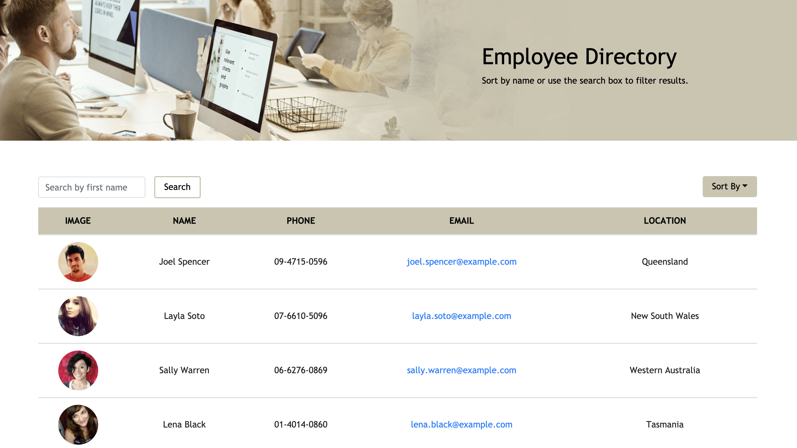

# Employee Directory

## Description
➤ Created using React, this app allows users to search for an employee by name or sort the employee list based on the available options.

## Table of Contents
* [Installation](#installation)
* [Usage](#usage)
* [License](#license)
* [Contributing](#contributing)
* [Tests](#tests)
* [Questions](#questions)
* [Screenshot](#screenshot)
* [Deployed Application](#deployed-application)

## Installation
```
Run npx create-react-app employee-directory locally and replace the src folder with this project's src.
```

## Usage
➤ Run npm start to start the application

## License
This app is covered under the following license/s:


## Contributing
➤ This project is open-source. Please reach out to the author for more information.

## Tests
```
None
```

## Questions
Please direct all questions to:

👤 https://github.com/xtineroq
📧 mcroque89@gmail.com

## Screenshot


## Deployed Application
[View on Heroku](https://cr-hw19-user-directory.herokuapp.com/)